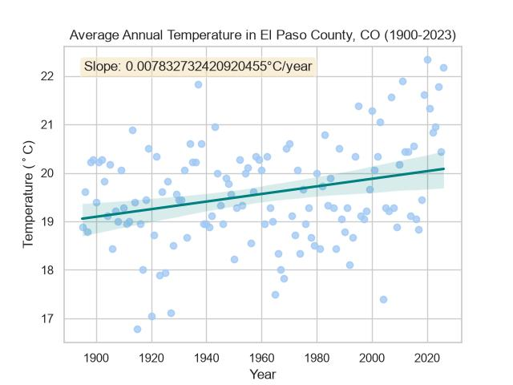
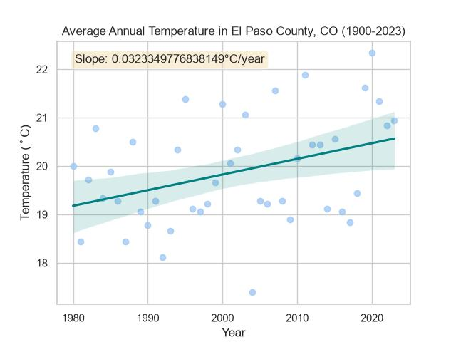

# El Paso County Temperature Analysis

## Yearly Average Temperature

  

    <iframe src="./img/ElPaso_yearly_avg_temp.html" width="100%" height="600" frameborder="0" style="display: block;"></iframe>
  

## Interactive Map

  

    <iframe src="./img/elpaso_map.html" width="100%" height="600" frameborder="0" style="display: block;"></iframe>
  

## Temperature Visualizations

  
  

