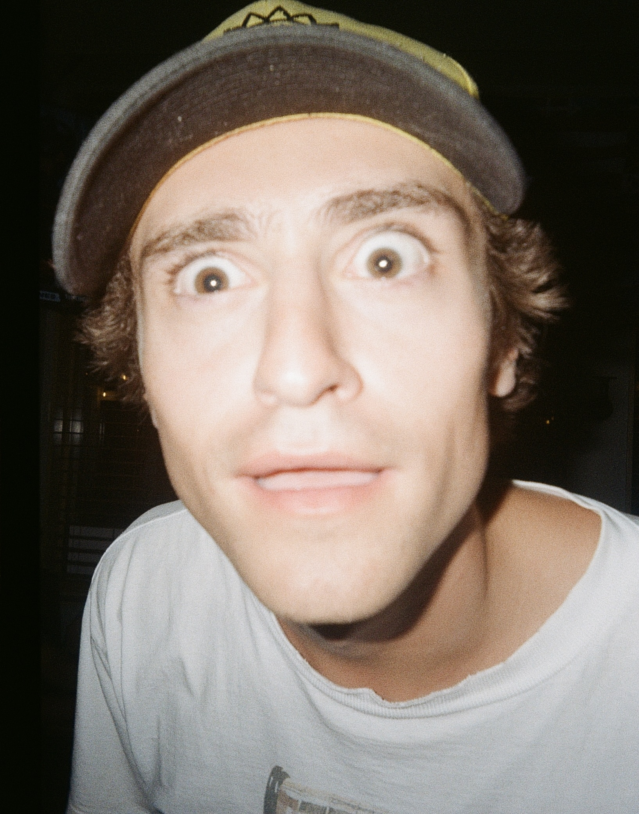

--- 
layout: default
---

# David Wilcox, Earth Science Project Portfolio
I am a current Master's student at CU (Geography Department). I am focused on remote sensing, and air pollution modeling. My previous work includes in-situ weather balloon data collection at the University of Oregon. I have also worked for NASA Develop creating oversampled TEMPO data, and helping to create a RF regression fog prediction model for the North Coast of California.

B.S. Environmental Geosciences, B.A. Environmental Studies (University of Oregon)

--- 

### Contact me: 
- linkedin: www.linkedin.com/in/david-c-wilcox
- github: [davidwilcoxbuffs](https://github.com/davidcwilcoxbuffs)
- email: david.wilcox@colorado.edu

I am excited to further my geospatial python skills, and delve into the world of remote sensing and GeoAI! 

I hope to create a robust model that can estimate ground level pollution levels using remotely sensed tropospheric column measurements. Which in hopes will create datasets that can be used in communities in which in-situ air quality data is not available, or under developed.

---

  

---

# Portfolio
### First Interactive Map created for Earth Analytics Bootcamp
A map showing the boundary polygon of Cassis, France. A small coastal town outside of Marseille. Upon visiting Cassis last summer, it quickly became one of my favorite locations. With close proximity to beautiful national parks, as well as the Mediterranean Sea, it is truly an awe-inspiring location. 
<iframe
  src="./img/cassis.html"
  width="600"
  height="600">
